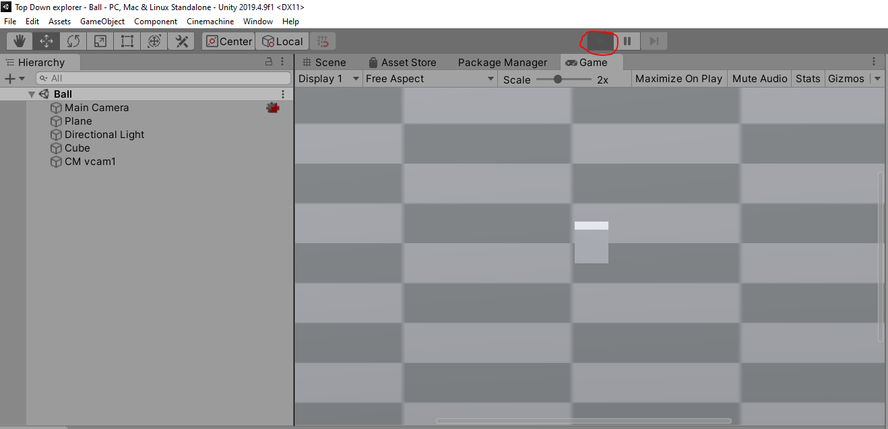
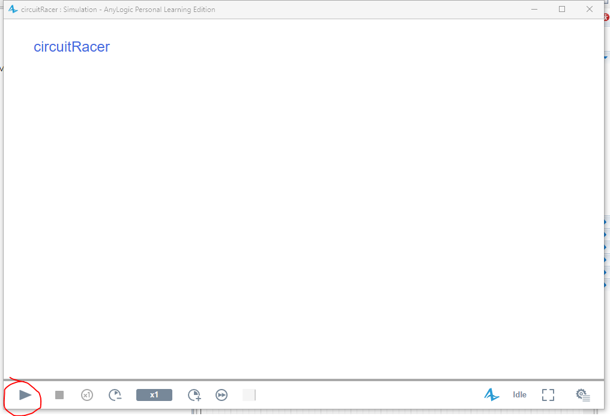
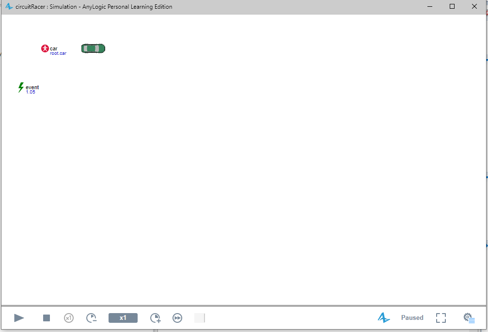

# Anylogic-circuit-racer

Communication between anylogic and unity. The driver (unity) communicates his position and anylogic updates it.

Software:

- Unity 2019.xxx

- Anylogic 8.3.3

How to use: 

1. Start Unity Play mode, Scene = Ball. The game will be paused (waiting for anylogic model).

2. Start anylogic model.

3. Anylogic will wait 3 seconds before updating the position.

4. After the 3 second event the car will update. It may be off screen.

5. Move Unity model (WASD) and see it update on Anylogic.

[Video](demo1.mp4)

